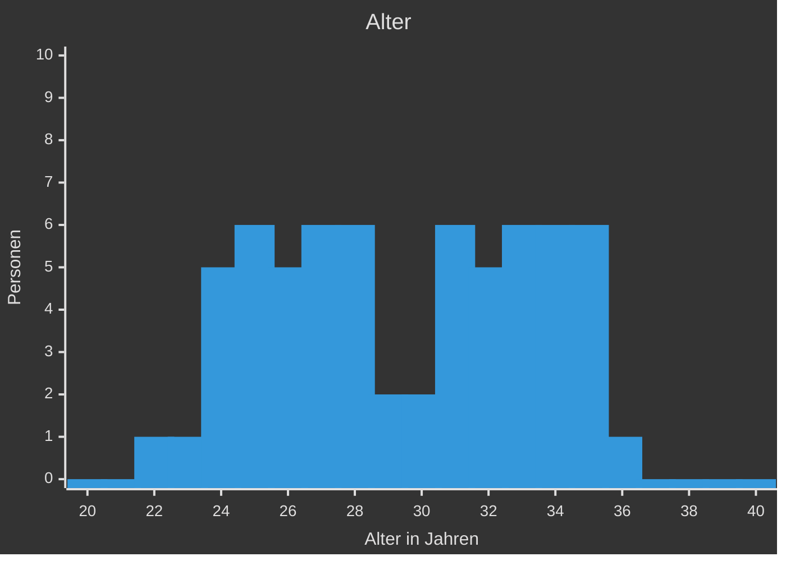
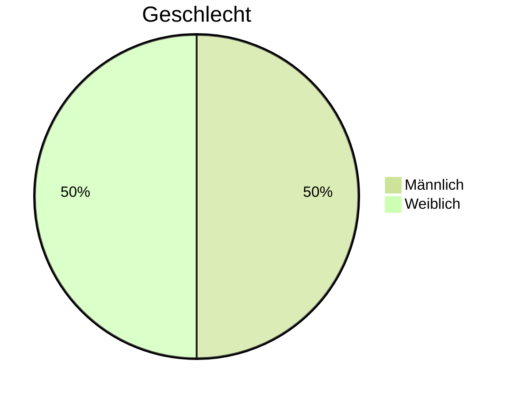
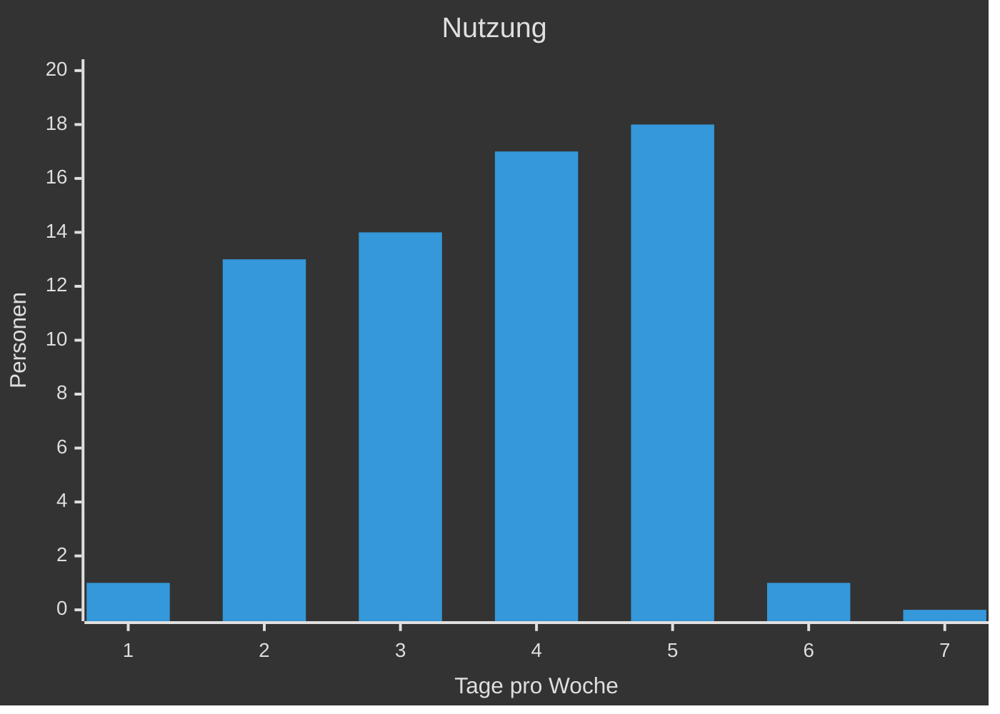
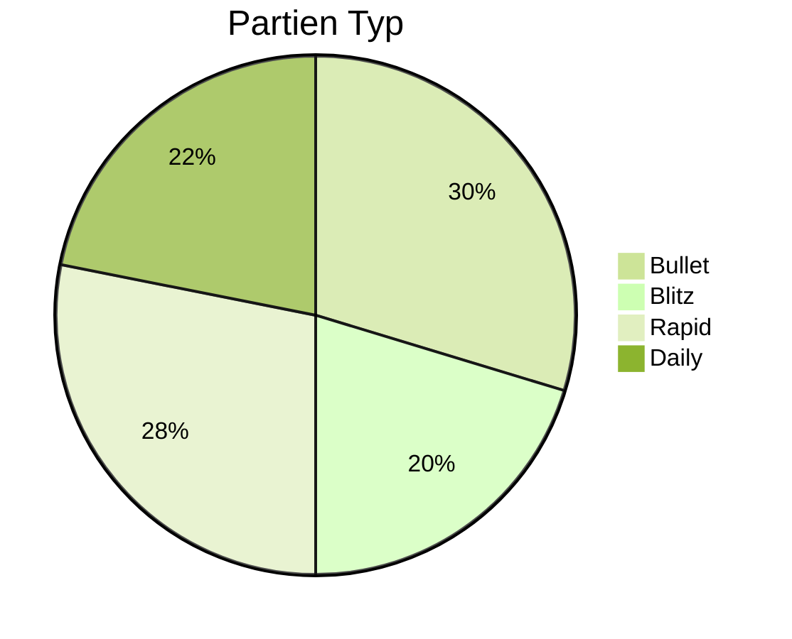
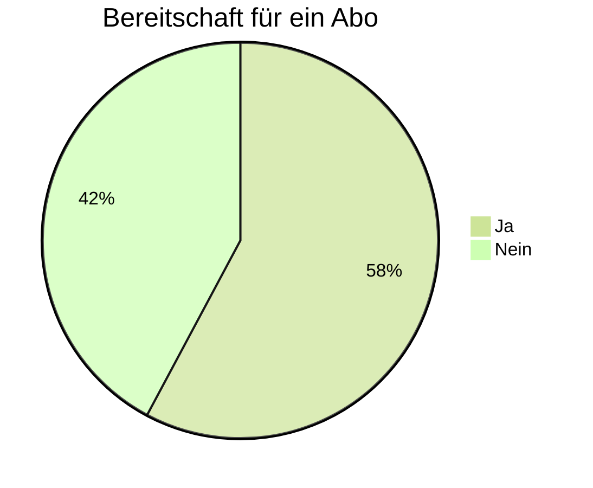

## Auswertung

Hier sind die Diagramme zu den Erfassten Daten von chess.com

### Alter

Das Durchschnittsalter der Spieler liegt bei 29 Jahren.
Jedoch gibt es sehr wenige Spieler, welche Tatsächlich 29 und 30 Jahre alt sind.

### Geschlecht

Die Geschlechterverteilung ist sehr ausgeglichen und endet bei 50/50

### Nutzung (Tage/Woche)

Die Nutzung von chess.com ist sehr unterschiedlich, wobei die meisten Spieler 4 oder 5 Tage pro Woche spielen.

### Partien Typ

Die meisten Nutzer bevorzugen kurze Partien und spielen Bullet oder Rapid.

### Abo Bereitschaft

Die Bereitschaft für ein Abo ist bei den meisten Nutzern gegeben.

